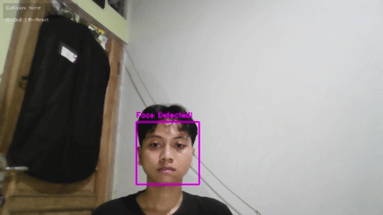

# Color-Object-Detection-Using-OpenCV
Detect Color &amp; Object Using OpenCV

## Description
This project is a real-time object detection application built with Python and OpenCV. It goes beyond simple color filtering by combining multi-object detection, accurate shape recognition, object distance detection, and collusion detection. The system can identify multiple red and yellow objects simultaneously, analyze their geometric shapes, and even detect interactions between objects on the screen.

---

## Features
- **Multi-Object Detection**: Capable of detecting and tracking all red and yellow objects in the frame simultaneously, not just the largest one.
- **Robust Shape Recognition**: Identifies shapes (**Circle, Square, Rectangle, Triangle**) by first calculating the contour's **Convex Hull** for improved stability, making it resilient to visual noise and imperfections.
- **Interactive Virtual Painter**: Draws a fading trail that follows the largest detected object of each color, allowing users to "paint" on the screen. The trail intelligently disappears when the object is removed.
- **Accurate Collision System**: Implements a precise **edge-to-edge distance calculation** between objects, triggering a visual "collision" alert only when their boundaries actually touch.
- **Face Detection**: Includes an additional Haar Cascade-based face detection feature.
- **Clean User Interface**: A non-intrusive Heads-Up Display (HUD) shows key information, with simple keyboard controls for interaction.

---

## Installation

### Prerequisites
- Python 3.7 or higher
- A connected webcam

### Installation Steps
1.  **Clone the repository:**
    ```bash
    git clone https://github.com/FisanSyafa/Color-Object-Detection-Using-OpenCV.git
    cd Color-Object-Detection-Using-OpenCV #Or your folder where you save
    ```

2.  **Create and activate a virtual environment (recommended):**
    -   **Windows:**
        ```bash
        python -m venv venv
        .\venv\Scripts\activate
        ```
    -   **macOS / Linux:**
        ```bash
        python3 -m venv venv
        source venv/bin/activate
        ```

3.  **Install the required libraries:**
    ```bash
    pip install opencv-python numpy
    ```

---

## How to Run

1.  Make sure your webcam is connected and not in use by another application.
2.  Run the main script from your terminal:
    ```bash
    python color_detector.py
    ```

### Controls
- **`Q`**: Quit the application.
- **`R`**: Reset the virtual painter trails.

---

## How the Code Works

The program operates within a main loop that processes each frame from the webcam in real-time. The logic is encapsulated within the `SmartColorDetector` class.

1.  **Frame Pre-processing**: Each frame is flipped horizontally (for a mirror effect) and a `bilateralFilter` is applied to reduce noise while preserving edges, resulting in a cleaner image for analysis.

2.  **Color Masking**: The frame is converted to the **HSV (Hue, Saturation, Value)** color space. A binary mask is created for each target color (Red, Yellow, and Blue for calibration). To handle detection fragmentation, **aggressive morphological operations** (`MORPH_CLOSE` and `MORPH_OPEN`) are applied with a large elliptical kernel (`11x11`). This merges nearby detections and fills holes, creating a single, solid mask for each physical object.

3.  **Contour Finding**: `cv2.findContours()` is used on the clean masks to identify all distinct objects.

4.  **Multi-Object Processing**: The code iterates through **every found contour** that meets a minimum area threshold. For each valid contour:
    -   **Shape Detection**: This is a key step for accuracy.
        1.  First, the contour's **Convex Hull** is calculated using `cv2.convexHull()`. This crucial step smooths the shape and removes noisy indentations, providing a clean outline.
        2.  The refined hull is then analyzed for **circularity**. If it's highly circular, it's immediately classified as a **"Circle"**.
        3.  If it's not a circle, `cv2.approxPolyDP` is used to count its vertices to identify it as a **"Triangle"**, **"Square"**, or **"Rectangle"**.
    -   **Visualization**: A rectangular bounding box is drawn around **every** detected object, while the text label (e.g., "Red Circle") accurately displays its identified shape.

5.  **Advanced Feature Logic**:
    -   **Virtual Painter Trail**: The center of the *largest* detected object for each color is appended to a `deque`. This `deque` is then used to draw the fading trail effect. If no object of a color is found, `None` is appended to break and hide the trail.
    -   **Collision & Distance**: For every pair of red and yellow objects, the code calculates the precise **edge-to-edge distance** using `cv2.pointPolygonTest`.

---

## GIF

- Red & Object Detection
  


- Yellow & Object Detection
  


- Face Detection
  


- Collusion & Distance Detection
  

